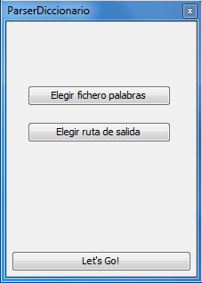

WRDictParser
============
Herramienta creada para agilizar la creación de diccionarios personalizados (XML) para el juego de Pasapalabra.
##Utilización

- **Elegir fichero palabras:** introducir fichero de texto con las palabras deseadas.
```
canción
dedo
entidad
```
- **Elegir ruta de salida:** directorio donde escribir el fichero de salida.
- **Let's Go!:** Haz magia.

***Finalmente se obtendrá un fichero con el siguiente formato:***
```XML
<?xml version="1.0" encoding="UTF-8"?>
<Diccionario>
	<Definicion>
		<Letra>c</Letra>
		<ListaEnunciados>
			<Enunciado>f. Composición, por lo general en verso, que se canta o a la que se puede poner música.</Enunciado>
			<Enunciado>Música con que se canta esta composición.</Enunciado>
			<Enunciado>Lo que se dice con repetición insistente o pesada.</Enunciado>
			<Enunciado>Noticia o pretexto sin fundamento. Más en pl..</Enunciado>
		</ListaEnunciados>
		<ListaRespuestas>
			<Respuesta>canción</Respuesta>
		</ListaRespuestas>
	</Definicion>
</Diccionario>
```

***Nota: Librería JSoup necesaria***
